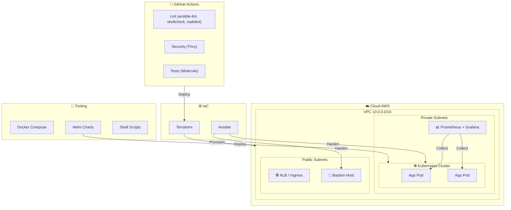

# 🛡️ DevOps Toolkit


**Infrastructure-as-Code, sécurité, monitoring et automatisation – production-grade.**

> Ce repo est mon portfolio technique : il démontre ma capacité à concevoir, sécuriser et opérer une infrastructure complète de bout en bout.

---

## 📐 Architecture Overview



---

## 🎯 Skills Demonstrated

| Domain                | Tools & Practices                                                                 | Level |
|-----------------------|------------------------------------------------------------------------------------|-------|
| **Cloud**             | AWS (VPC, EC2, IAM, S3), Terraform, Terragrunt                                     | ⭐⭐⭐ |
| **Containers**        | Docker, Docker Compose, BuildKit, distroless                                       | ⭐⭐⭐ |
| **Orchestration**     | Kubernetes, Helm, HPA, PDB, NetworkPolicies, RBAC                                 | ⭐⭐⭐ |
| **IaC**               | Ansible (Molecule), Terraform (modules, workspaces), Cloud-init                   | ⭐⭐⭐ |
| **CI/CD**             | GitHub Actions, Trivy, pre-commit, semantic release                                 | ⭐⭐⭐ |
| **Security**          | CIS benchmarks, fail2ban, IMDSv2, encrypted volumes, least-privilege, seccomp        | ⭐⭐⭐ |
| **Monitoring**        | Prometheus, Grafana, node_exporter                                               | ⭐⭐ |
| **Scripting**         | Bash (POSIX, shellcheck-clean), Python                                           | ⭐⭐⭐ |

---

## 📂 What's Inside

### 🔒 Ansible Playbooks (idempotent, CIS-aligned)

| Playbook | Description | Tests |
|----------|-------------|-------|
| `ansible/hardening/` | SSH, UFW, sysctl, auditd, fail2ban, auto-updates | Molecule + Testinfra |
| `ansible/docker-install/` | Docker CE + Compose, daemon hardening | Ad-hoc |
| `ansible/monitoring-setup/` | Prometheus node_exporter + Grafana Agent | Ad-hoc |
| `ansible/backup/` | Restic automated backups with rotation | Ad-hoc |

### 🏗️ Terraform Modules

```bash
cd terraform/environments/dev
terraform init
terraform plan
```

| Module | Features |
|--------|----------|
| `modules/vpc/` | Multi-AZ, public/private, IGW, NAT-ready, SG with least-privilege |
| `modules/compute/` | Encrypted EBS, IMDSv2, SSM access, cloud-init bootstrap |

### ☸️ Kubernetes

| Artifact | Security Features |
|----------|-----------------|
| `kubernetes/base/deployment.yaml` | Non-root, read-only root FS, `drop: ALL` capabilities, seccomp, resource limits |
| `kubernetes/monitoring/` | ServiceMonitor, Grafana dashboard ConfigMap |
| `kubernetes/helm/` | Production Helm chart with HPA, PDB, NetworkPolicy |

### 🐳 Docker

| File | Highlights |
|------|-----------|
| `compose-template` | Security opts, cap_drop, healthchecks, log rotation, resource limits |
| `Dockerfile.*` | Multi-stage, non-root, `npm ci --only=production`, minimal attack surface |

### 📜 Shell Scripts

Tous les scripts passent `shellcheck -S warning` : `set -euo pipefail`, variables quoted, pas de `eval`.

| Script | Use Case |
|--------|----------|
| `server-init.sh` | Bootstrap serveur frais (Debian/Ubuntu) |
| `docker-cleanup.sh` | Nettoyage sécurisé + dry-run |
| `health-check.sh` | Rapport complet (text / JSON) |
| `ssl-check.sh` | Vérification certificats |
| `backup-db.sh` | Backup PostgreSQL/MySQL avec rotation |

### 🔄 CI/CD

| Workflow | Outcome |
|----------|---------|
| `ci.yml` | shellcheck + ansible-lint + yamllint + hadolint + molecule + terraform fmt + k8s dry-run |
| `security.yml` | Trivy filesystem scan → SARIF → GitHub Security tab |
| `pre-commit` | Hooks locaux avant chaque commit |

---

## 🚀 Quick Start

### 1. Ansible — Hardening a server

```bash
ansible-playbook ansible/hardening/main.yml -i inventory.ini -u admin --limit production
```

### 2. Terraform — Spin up infrastructure

```bash
cd terraform/environments/dev
export AWS_PROFILE=default
terraform init
terraform plan -var="ssh_key_name=my-key"
terraform apply
```

### 3. Kubernetes — Deploy to cluster

```bash
kubectl apply -f kubernetes/base/
helm upgrade --install app kubernetes/helm/devops-toolkit
```

### 4. Local development

```bash
make setup   # Install pre-commit, linters
make lint    # Run all linters
make test    # Run Molecule tests
make all     # Full CI simulation locally
```

---

## 🛡️ Security Highlights

| Layer | Hardening |
|-------|-----------|
| **OS** | CIS-aligned sysctl, SSH (no root, no password), fail2ban, UFW, auditd |
| **Cloud** | IMDSv2 enforced, encrypted EBS, SSM (no SSH key needed), least-privilege SG |
| **Containers** | Non-root, read-only root fs, `cap_drop: ALL`, health checks, resource limits |
| **K8s** | NetworkPolicies, PodSecurityStandards restricted, RBAC, HPA, PDB |
| **CI/CD** | Trivy scan on every push + weekly schedule, SARIF upload, no secrets in code |

---

## 📁 Directory Structure

```
devops-toolkit/
├── ansible/
│   ├── hardening/           # CIS-inspired hardening (molecule tested)
│   ├── docker-install/      # Docker CE setup
│   ├── monitoring-setup/    # Node exporter + metrics
│   └── backup/              # Restic backup automation
├── terraform/
│   ├── modules/
│   │   ├── vpc/             # Reusable VPC module
│   │   └── compute/         # Reusable EC2 module
│   └── environments/
│       ├── dev/             # Dev workspace
│       ├── staging/         # Staging workspace
│       └── prod/            # Prod workspace
├── kubernetes/
│   ├── base/                # Deployments, Services, HPA, NetworkPolicy, PDB
│   ├── monitoring/          # Prometheus ServiceMonitor, Grafana Dashboard
│   └── helm/devops-toolkit/ # Production Helm chart
├── docker/
│   ├── compose-template/    # Secure docker-compose.yml
│   └── healthcheck-images/  # Multi-stage, non-root Dockerfiles
├── scripts/
│   ├── server-init.sh       # Server bootstrap (shellcheck clean)
│   ├── docker-cleanup.sh    # Safe cleanup
│   ├── health-check.sh      # Reporting
│   ├── ssl-check.sh         # SSL monitoring
│   └── backup-db.sh         # DB backup with rotation
├── ci/                      # CI/CD templates (GitHub Actions + GitLab CI)
├── .github/workflows/       # CI pipelines
├── Makefile                 # Unified build orchestration
├── requirements.yml           # Ansible collections
└── .pre-commit-config.yaml  # Pre-commit hooks
```

---

## 🔧 Tooling Matrix

| Tool | Version | Purpose |
|------|---------|---------|
| Ansible | 2.16+ | Server configuration |
| Terraform | 1.9+ | Cloud infrastructure |
| Kubernetes | 1.29+ | Container orchestration |
| Helm | 3.15+ | K8s package management |
| Docker | 24.x+ | Containerization |
| shellcheck | 0.9+ | Shell script quality |
| ansible-lint | 6.22+ | Ansible quality |
| Trivy | 0.50+ | Security scanning |

---

## 📝 Notes for Recruiters

> Ce dépôt est conçu comme **preuve opérationnelle** de mes compétences. Chaque composant est :
> - **Lint-clean** (shellcheck 0 warnings, ansible-lint 0 violations, hadolint pass)
> - **Testé** (Molecule pour Ansible, CI sur chaque push)
> - **Sécurisé** (CIS, least-privilege, Trivy scan, encrypted à tous les niveaux)
> - **Documenté** (README, inline comments, Makefile avec `make help`)

N'hésitez pas à explorer les playbooks, les modules Terraform, et la CI. Un `make all` suffit pour reproduire l'intégralité des vérifications.

---

**License**: MIT — libre de réutilisation avec attribution.
